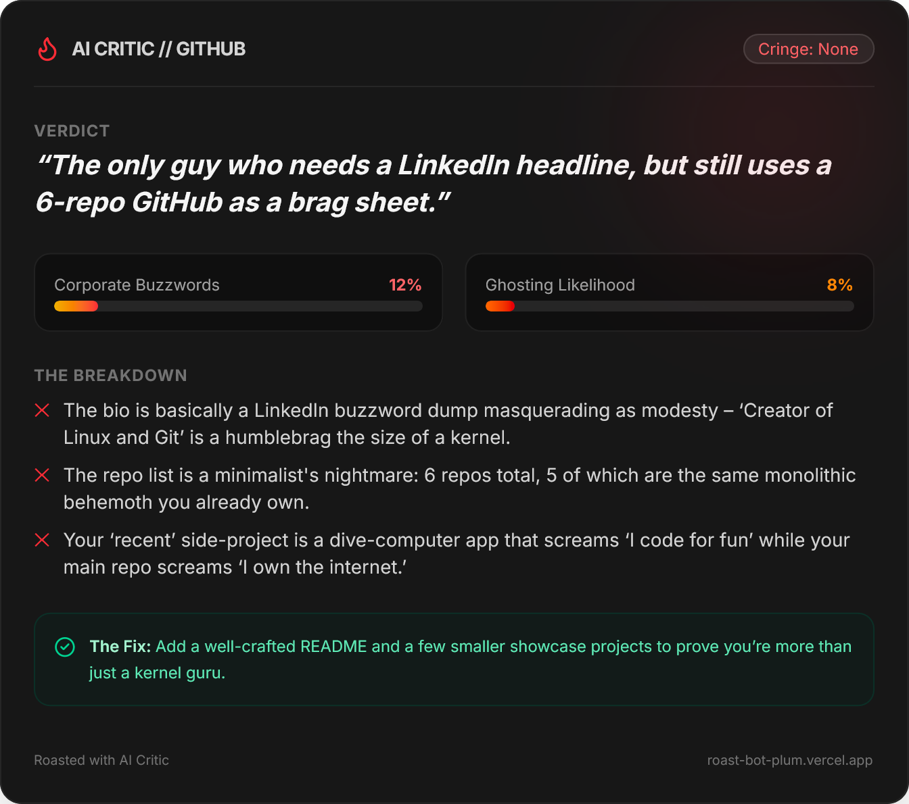

# 🔥 Roast My Profile — Savage AI Career Critic

[](https://roast-bot-plum.vercel.app/)
[](https://nextjs.org/)
[](https://groq.com/)
[](https://tailwindcss.com/)
[](https://vercel.com/analytics)

An internet-culture-fluent AI critic that dissects developer resumes, LinkedIn headlines, and GitHub profiles with brutal honesty. Features zero-friction GitHub account ingestion, dynamic LLM failover, client-side rasterized shareable cards, and native OpenGraph generation.

---

## 🖼️ Preview

<div align="center">
  
</div>

---

## ✨ Features

- ⚡ **Zero-Friction GitHub Ingestion:** Input any public GitHub username (e.g., `@torvalds`) to instantly pull public metadata, bio, follower metrics, and top 5 recent repositories with language and star counts.
- 🎯 **Multi-Surface Roast Engine:** Specialized evaluation prompts tailored for technical resumes, LinkedIn bio fluff, and open-source GitHub handles.
- 📊 **Structured Metric Synthesis:** Enforces JSON schema extraction to derive quantifiable metrics (*Corporate Buzzword Toxicity*, *Ghosting Likelihood*, and *Cringe Rating*).
- 🖼️ **One-Click Shareable Cards:** Client-side DOM rasterization via `html-to-image` renders 2x pixel-density PNG cards ready for social feeds.
- 🐦 **Instant Social Distribution:** One-click intent linking to post verdicts directly to X (Twitter).
- 📈 **Product Engagement Telemetry:** Integrated Vercel Web Analytics tracking custom completion and download conversion funnels.

---

## 🏗️ Architecture & Engineering Highlights

```text
┌─────────────────┐       ┌────────────────────────┐       ┌──────────────────────┐
│  Client (React) │ ────> │  Next.js Server Route  │ ────> │  Groq Cloud LPU API  │
│  - Form & State │       │  - Model Negotiation   │       │  - Catalog Lookup    │
│  - DOM Canvas   │ <──── │  - JSON Schema Guard   │ <──── │  - Fast Completion   │
└─────────────────┘       └────────────────────────┘       └──────────────────────┘
         │
         ▼
┌────────────────────────┐
│ GitHub REST API        │
│ [[api.github.com/users](https://api.github.com/users)] │
└────────────────────────┘

```

### 1. Dynamic Model Negotiation & Catalog Discovery

Rather than hardcoding fragile model strings, the backend queries Groq's `/v1/models` endpoint at runtime. It prioritizes the highest-quality conversational LLMs available to the API key's current authorization tier, preventing 404 access breakages during provider catalog updates.

### 2. Deterministic Schema Enforcement

By constraining model outputs with `response_format: { type: 'json_object' }` and markdown stripping guards, non-deterministic language responses are transformed into structured primitives that feed visual progress meters and callout tags:

```json
{
  "punchline": "A one-sentence summary of their profile",
  "corporateSpeakRating": 85,
  "ghostingRisk": 90,
  "cringeFactor": "Terminal",
  "bulletRoasts": ["Roast point 1", "Roast point 2", "Roast point 3"],
  "actualAdvice": "Tactical feedback to make this actually useful."
}

```

### 3. Sub-Second Inference Latency

Leverages Groq's LPU architecture, bringing time-to-first-token down to under 400ms for conversational inference.

---

## 🛠️ Getting Started

### Prerequisites

* **Node.js:** v18.x or higher
* **Groq API Key:** Obtain a free key from the [Groq Console](https://console.groq.com/?utm_source=gemini)

### Local Setup

1. **Clone the repository:**
```bash
git clone [https://github.com/Vipash/ai-roast-bot.git](https://github.com/Vipash/ai-roast-bot.git)
cd ai-roast-bot

```


2. **Install dependencies:**
```bash
npm install

```


3. **Configure Environment Variables:**
Create a `.env.local` file in the root directory:
```env
OPENAI_API_KEY=gsk_your_groq_api_key_here

```


> **Note:** The key name `OPENAI_API_KEY` is used because the service utilizes Groq's OpenAI-compatible API spec.


4. **Run the development server:**
```bash
npm run dev

```


5. **Open the Application:**
Visit [http://localhost:3000](http://localhost:3000?utm_source=gemini) in your browser.

---

## 📦 Project Structure

```text
├── app/
│   ├── api/
│   │   └── roast/
│   │       └── route.ts       # Runtime model discovery & LLM prompt pipeline
│   ├── globals.css            # Dark mode styles & Tailwind primitives
│   ├── layout.tsx             # Root layout, analytics & SEO meta tags
│   ├── opengraph-image.tsx    # Dynamic edge-rendered social card (ImageResponse)
│   └── page.tsx               # Reactive UI, GitHub fetcher & Share card canvas
├── public/                    # Static assets & screenshot previews
├── .env.local                 # Ignored local environment secrets
├── package.json               # Project dependencies and scripts
└── tailwind.config.ts         # Tailwind CSS styling design tokens

```

---

## 🚀 Deployment

Deploy seamlessly using [Vercel](https://vercel.com/?utm_source=gemini):

1. Push your repository to GitHub.
2. Import the project into Vercel.
3. Add the `OPENAI_API_KEY` environment variable with your Groq key.
4. Click **Deploy**.

---

## 🛡️ License

This project is licensed under the MIT License. Free to use, modify, and distribute.